<div align="center">

# 🍞 암기빵 (RememBread)

### 출퇴근길 공부하는 직장인/학생을 위한 손 안의 학습 플랫폼

**출퇴근길에 굽는 지식 한 조각**

언제 어디서나 간편하게 학습할 수 있는 PWA 기반 플래시카드 학습 서비스

[](https://reactjs.org/)
[](https://www.typescriptlang.org/)
[](https://vitejs.dev/)
[](https://tailwindcss.com/)
[](https://web.dev/progressive-web-apps/)

</div>

---

## 📑 목차

- [✨ 서비스 소개](#-서비스-소개)
- [🎯 주요 기능](#-주요-기능)
- [🛠 기술 스택](#-기술-스택)
- [📁 프로젝트 구조](#-프로젝트-구조)
- [🚀 시작하기](#-시작하기)
- [⚙️ 환경 변수 설정](#️-환경-변수-설정)
- [📚 개발 가이드](#-개발-가이드)
- [🏗 빌드 및 배포](#-빌드-및-배포)

---

## ✨ 서비스 소개

> 바쁜 일상 속에서도 효율적으로 학습할 수 있도록 돕는 모바일 최적화 학습 플랫폼

<br/>

<table >
<tr>
<td width="20%" align="center">🚀</td>
<td width="80%"><b>접근성</b><br/>PWA로 구현되어 앱 설치 없이 즉시 사용 가능</td>
</tr>
<tr>
<td align="center">✨</td>
<td><b>편의성</b><br/>PDF, 텍스트, 이미지 등 다양한 형식으로 손쉽게 플래시카드 생성</td>
</tr>
<tr>
<td align="center">📍</td>
<td><b>위치 기반 학습</b><br/>출퇴근 경로에 맞춰 자동으로 학습 알림</td>
</tr>
<tr>
<td align="center">🎮</td>
<td><b>재미</b><br/>빵 캐릭터와 함께하는 게임화된 학습 경험</td>
</tr>
<tr>
<td align="center">📊</td>
<td><b>데이터 기반</b><br/>학습 기록 분석을 통한 맞춤형 학습 관리</td>
</tr>
</table>

<br/>

---

## 🎯 주요 기능

### 📝 1. 인덱스 카드 생성

> 다양한 방식으로 나만의 플래시카드를 만들 수 있습니다.

| 방법 | 설명 |
|------|------|
| 📄 **PDF 업로드** | PDF 파일을 업로드하여 자동으로 플래시카드 생성 |
| 📝 **텍스트 입력** | 텍스트를 붙여넣거나 입력하여 카드 생성 |
| 🖼️ **이미지 OCR** | 이미지에서 텍스트를 추출하여 카드 생성 |
| ✏️ **직접 작성** | 전통적인 방식으로 질문/답변 직접 입력 |

<details>
<summary>📌 주요 컴포넌트</summary>

- [CreateFromPDFPage.tsx](src/pages/createIndexCard/CreateFromPDFPage.tsx)
- [CreateFromTextPage.tsx](src/pages/createIndexCard/CreateFromTextPage.tsx)
- [CreateFromImagePage.tsx](src/pages/createIndexCard/CreateFromImagePage.tsx)
- [CreateFromSelfPage.tsx](src/pages/createIndexCard/CreateFromSelfPage.tsx)

</details>

<br/>

### 🗺️ 2. 학습지도

> **출퇴근길을 학습 시간으로 바꾸는 위치 기반 학습 알림 시스템**

- 📡 **실시간 위치 추적** — 15초마다 현재 위치 자동 업데이트  
- 🔔 **알림 구역 설정** — 지정 위치 도착 시 학습 알림 발송  
- 🗺️ **네이버 지도 연동** — 직관적인 인터페이스로 손쉬운 위치 관리  

<details>
<summary>📌 주요 컴포넌트</summary>

- [MapPage.tsx](src/pages/MapPage.tsx)  
- [MapView.tsx](src/components/studyMap/MapView.tsx)  
- [map.ts](src/services/map.ts) — 위치 기반 알림 서비스 로직

</details>

<br/>

<p align="center">
  
  
  
  
</p>

<p align="center">
  <sub>🏷️ 빵길 시각화 · 위치 알림 설정 · 핀 지정 모드 · 설정 메뉴</sub>
</p>


<br/>

### 📚 3. 인덱스 카드 학습

> 체계적인 학습 시스템으로 효과적으로 암기하세요.

```
✅ 카드 세트 관리 - 폴더별로 체계적인 카드 정리
🔍 검색 및 필터 - 최신순, 인기순, 포크 수 등 다양한 정렬 옵션
```

**학습 모드**
- 📖 일반 학습 모드
- 🔊 TTS (음성 읽기) 모드
- 💡 개념 테스트 모드
- 📝 설명 테스트 모드

**부가 기능**
- ❤️ 공유 기능: 좋아요, 포크(복사) 기능으로 다른 사용자의 카드 활용
- 📈 학습 진도 추적: 실시간 학습 기록 저장

<details>
<summary>📌 주요 컴포넌트</summary>

- [CardViewPage.tsx](src/pages/indexCardSetView/CardViewPage.tsx)
- [CardStudyPage.tsx](src/pages/indexCardSetView/CardStudyPage.tsx)
- [CardTTSPage.tsx](src/pages/indexCardSetView/CardTTSPage.tsx)
- [ConceptTestPage.tsx](src/pages/cardTest/ConceptTestPage.tsx)
- [ExplainTestPage.tsx](src/pages/cardTest/ExplainTestPage.tsx)

</details>

<br/>

### 🎮 4. 두뇌 게임

> 빵 캐릭터와 함께하는 재미있는 학습 게임들

<table>
<tr>
<td align="center">🧠</td>
<td><b>메모리 게임</b><br/>카드 매칭을 통한 기억력 향상</td>
<td align="center">⚖️</td>
<td><b>비교 게임</b><br/>개념 비교를 통한 이해도 향상</td>
</tr>
<tr>
<td align="center">🔍</td>
<td><b>탐정 게임</b><br/>추리형 학습 게임</td>
<td align="center">👤</td>
<td><b>그림자 게임</b><br/>패턴 인식 게임</td>
</tr>
<tr>
<td align="center" colspan="2">🏆</td>
<td colspan="2"><b>랭킹 시스템</b><br/>실시간 리더보드로 경쟁</td>
</tr>
</table>

<details>
<summary>📌 주요 컴포넌트</summary>

- [GamesPage.tsx](src/pages/GamesPage.tsx)
- [GameModePage.tsx](src/pages/games/GameModePage.tsx)
- [MemoryGamePage.tsx](src/pages/games/MemoryGamePage.tsx)
- [CompareGamePage.tsx](src/pages/games/CompareGamePage.tsx)
- [DetectiveGamePage.tsx](src/pages/games/DetectiveGamePage.tsx)
- [ShadowGamePage.tsx](src/pages/games/ShadowGamePage.tsx)
- [RankPage.tsx](src/pages/games/RankPage.tsx)

</details>

<br/>

### 👤 5. 프로필

> 학습 기록과 게임 성과를 한눈에 확인하세요.

- 🎨 **사용자 정보 관리**: 프로필 편집 및 캐릭터 선택
- 🎯 **게임 기록**: 과거 게임 성과 확인
- 📊 **학습 분석**: 바차트를 통한 학습 패턴 시각화
- 🔥 **학습 스트릭**: 연속 학습일 추적
- 🔔 **푸시 알림 설정**: FCM 토큰 관리

<details>
<summary>📌 주요 컴포넌트</summary>

- [ProfilePage.tsx](src/pages/profile/ProfilePage.tsx)
- [Profile.tsx](src/components/profile/Profile.tsx)
- [GameHistory.tsx](src/components/profile/GameHistory.tsx)
- [StudyHistory.tsx](src/components/profile/StudyHistory.tsx)
- [StudyBarChart.tsx](src/components/profile/StudyBarChart.tsx)

</details>

<br/>

## 🛠 기술 스택

### 🎨 Frontend Core

| 기술 | 버전 | 설명 |
|------|------|------|
|  | 18.3.1 | 사용자 인터페이스 구축 |
|  | 5.7.2 | 타입 안전성을 위한 정적 타입 언어 |
|  | 6.3.1 | 빠른 빌드 도구 및 개발 서버 |
|  | 7.5.2 | 클라이언트 사이드 라우팅 |

### 📦 상태 관리 및 데이터 페칭

| 기술 | 버전 | 설명 |
|------|------|------|
|  | 5.0.3 | 경량 전역 상태 관리 |
|  | 5.74.4 | 서버 상태 관리 및 캐싱 |
|  | 1.9.0 | HTTP 클라이언트 (자동 토큰 갱신) |

### 🎨 UI/UX

| 기술 | 버전 | 설명 |
|------|------|------|
|  | 3.4.17 | 유틸리티 우선 CSS 프레임워크 |
|  | Latest | 접근성 높은 헤드리스 컴포넌트 |
|  | 12.10.4 | 애니메이션 라이브러리 |
|  | 0.503.0 | 아이콘 라이브러리 |
|  | 2.15.3 | 데이터 시각화 차트 |

### ⚡ 특수 기능

| 기술 | 버전 | 설명 |
|------|------|------|
|  | 11.7.1 | 푸시 알림 (FCM) |
|  | 5.2.133 | PDF 파싱 및 처리 |
|  | Plugin | Progressive Web App 기능 |
|  | Types | 지도 연동 |

### 🔐 인증

<table>
<tr>
<td align="center"></td>
<td align="center"></td>
<td align="center"></td>
</tr>
<tr>
<td align="center">카카오 소셜 로그인</td>
<td align="center">네이버 소셜 로그인</td>
<td align="center">구글 소셜 로그인</td>
</tr>
</table>

<br/>

## 📁 프로젝트 구조

<details>
<summary>📂 전체 디렉토리 구조 보기</summary>

```
RememBread_frontend/
├── public/
│   ├── logo.png                        # 앱 로고
│   ├── firebase-messaging-sw.js        # FCM 서비스 워커
│   └── pdf.worker.js                   # PDF.js 워커
├── src/
│   ├── components/                     # 재사용 가능한 컴포넌트
│   │   ├── common/                     # 공통 컴포넌트 (Layout, Header, Footer 등)
│   │   ├── dialog/                     # 모달 다이얼로그
│   │   ├── folder/                     # 폴더 관리
│   │   ├── footer/                     # 하단 네비게이션
│   │   ├── game/                       # 게임 관련 컴포넌트
│   │   ├── indexCardView/              # 플래시카드 뷰
│   │   ├── profile/                    # 프로필 관련 컴포넌트
│   │   ├── studyMap/                   # 학습지도 컴포넌트
│   │   ├── svgs/                       # SVG 아이콘 (빵 캐릭터 등)
│   │   ├── tutorial/                   # 튜토리얼
│   │   └── ui/                         # 기본 UI 컴포넌트 (shadcn/ui 스타일)
│   ├── pages/                          # 페이지 컴포넌트
│   │   ├── cardTest/                   # 테스트 페이지 (개념/설명 모드)
│   │   ├── createIndexCard/            # 카드 생성 페이지 (PDF/Text/Image/Self)
│   │   ├── games/                      # 게임 페이지
│   │   ├── indexCardSetView/           # 카드 뷰 및 학습 페이지
│   │   ├── login/                      # 인증 페이지
│   │   ├── profile/                    # 프로필 페이지
│   │   ├── HomePage.tsx                # 홈 페이지
│   │   ├── GamesPage.tsx               # 게임 메인 페이지
│   │   ├── LoginPage.tsx               # 로그인 페이지
│   │   └── MapPage.tsx                 # 지도 페이지
│   ├── services/                       # API 서비스 레이어
│   │   ├── authService.ts              # 인증 API
│   │   ├── card.ts                     # 플래시카드 CRUD
│   │   ├── cardSet.ts                  # 카드 세트 관리
│   │   ├── folder.ts                   # 폴더 관리
│   │   ├── gameService.ts              # 게임 관련 API
│   │   ├── map.ts                      # 위치 기반 기능
│   │   ├── study.ts                    # 학습 세션 추적
│   │   ├── userService.ts              # 사용자 관리
│   │   ├── httpCommon.ts               # Axios 인스턴스 및 인터셉터
│   │   └── endPoints.ts                # API 엔드포인트 상수
│   ├── stores/                         # Zustand 상태 관리
│   │   ├── cardStore.ts                # 플래시카드 상태
│   │   ├── gameStore.ts                # 게임 상태
│   │   ├── profileStore.ts             # 프로필 상태
│   │   ├── studyRecord.ts              # 학습 기록
│   │   ├── termsStore.ts               # 약관 동의 상태
│   │   └── useLocationStore.ts         # 위치 정보 상태
│   ├── types/                          # TypeScript 타입 정의
│   │   ├── folder.ts
│   │   ├── game.ts
│   │   ├── indexCard.ts
│   │   ├── profile.ts
│   │   └── svg.ts
│   ├── hooks/                          # 커스텀 React 훅
│   ├── lib/                            # 라이브러리 설정
│   │   ├── firebase/                   # Firebase FCM 설정
│   │   ├── queryClient.ts              # React Query 클라이언트
│   │   └── utils.ts                    # 유틸리티 함수
│   ├── utils/                          # 헬퍼 함수
│   ├── constants/                      # 앱 상수
│   ├── styles/                         # 글로벌 스타일
│   ├── routes/
│   │   └── router.tsx                  # 라우트 설정 (보호된 라우트 포함)
│   └── main.tsx                        # 앱 진입점
├── .env                                # 환경 변수
├── vite.config.ts                      # Vite 설정
├── tailwind.config.js                  # Tailwind CSS 설정
├── components.json                     # shadcn/ui 설정
├── tsconfig.json                       # TypeScript 설정
└── package.json                        # 프로젝트 의존성
```

</details>

<br/>

---

## 🚀 시작하기

### 📋 필수 요구사항


### 💻 설치 및 실행

**1️⃣ 저장소 클론**

```bash
git clone <repository-url>
cd RememBread_frontend
```

**2️⃣ 의존성 설치**

```bash
npm install
```

**3️⃣ 환경 변수 설정**

`.env` 파일을 프로젝트 루트에 생성하고 필요한 환경 변수를 설정합니다.
자세한 내용은 [⚙️ 환경 변수 설정](#️-환경-변수-설정) 섹션을 참고하세요.

**4️⃣ 개발 서버 실행**

```bash
npm run dev
```

🎉 개발 서버가 `http://localhost:5173`에서 실행됩니다!

<br/>

---

## ⚙️ 환경 변수 설정

`.env` 파일에 다음 환경 변수들을 설정해야 합니다:

```env
# 백엔드 API
VITE_BACKEND_URL=https://remembread.co.kr/api

# 프론트엔드 URL
VITE_FRONTEND_URL=https://remembread.co.kr

# 소셜 로그인 Client ID
VITE_KAKAO_CLIENT_ID=your_kakao_client_id
VITE_NAVER_CLIENT_ID=your_naver_client_id
VITE_GOOGLE_CLIENT_ID=your_google_client_id

# 네이버 지도 API
VITE_NAVER_MAP_CLIENT_ID=your_naver_map_client_id

# Firebase Configuration
VITE_FIREBASE_API_KEY=your_firebase_api_key
VITE_FIREBASE_AUTH_DOMAIN=your_firebase_auth_domain
VITE_FIREBASE_PROJECT_ID=your_firebase_project_id
VITE_FIREBASE_STORAGE_BUCKET=your_firebase_storage_bucket
VITE_FIREBASE_MESSAGING_SENDER_ID=your_firebase_messaging_sender_id
VITE_FIREBASE_APP_ID=your_firebase_app_id
VITE_FIREBASE_MEASUREMENT_ID=your_firebase_measurement_id
VITE_FIREBASE_VAPID_KEY=your_firebase_vapid_key
```

<br/>

---

## 📚 개발 가이드

### 🛣️ 라우팅

> React Router v7을 사용하며, 인증이 필요한 라우트는 `ProtectedOutlet`으로 보호됩니다.

📄 **라우터 설정**: [router.tsx](src/routes/router.tsx)

<table>
<tr>
<th>🌍 공개 라우트</th>
<th>🔒 보호된 라우트</th>
</tr>
<tr>
<td valign="top">

- `/login` - 소셜 로그인
- `/account/login/:socialType` - OAuth 콜백
- `/signup/terms` - 약관 동의
- `/signup/terms/:termId` - 개별 약관 상세

</td>
<td valign="top">

- `/` - 기본 (카드 뷰로 리다이렉트)
- `/create/*` - 카드 생성 플로우
- `/save` - 카드 저장
- `/card-view` - 카드 라이브러리
- `/study/:cardSetId` - 학습 세션
- `/test/:indexCardId/*` - 테스트 모드
- `/profile` - 프로필
- `/games/*` - 게임 섹션
- `/map` - 학습지도

</td>
</tr>
</table>

### 🔐 인증 플로우

```mermaid
graph LR
    A[사용자 요청] --> B{토큰 유효?}
    B -->|Yes| C[요청 처리]
    B -->|No| D[토큰 갱신]
    D --> E{갱신 성공?}
    E -->|Yes| C
    E -->|No| F[로그인 페이지]
```



**인증 프로세스**
1. 🎫 **토큰 기반 인증**: Bearer 토큰 사용
2. 🔄 **자동 토큰 갱신**: 401 에러 시 자동으로 리프레시 토큰 사용
3. 🍪 **리프레시 토큰**: HTTP-only 쿠키로 안전하게 저장 (`withCredentials: true`)
4. 🔒 **토큰 큐 시스템**: 갱신 중 발생하는 race condition 방지

📄 **관련 파일**: [httpCommon.ts](src/services/httpCommon.ts)

### 📦 상태 관리

<table>
<tr>
<th>🐻 Zustand Stores</th>
<th>📄 파일</th>
<th>📝 설명</th>
</tr>
<tr>
<td><b>cardStore</b></td>
<td><a href="src/stores/cardStore.ts">cardStore.ts</a></td>
<td>현재 플래시카드 세트 관리</td>
</tr>
<tr>
<td><b>gameStore</b></td>
<td><a href="src/stores/gameStore.ts">gameStore.ts</a></td>
<td>게임 진행 상태 및 점수</td>
</tr>
<tr>
<td><b>profileStore</b></td>
<td><a href="src/stores/profileStore.ts">profileStore.ts</a></td>
<td>사용자 프로필 및 환경설정</td>
</tr>
<tr>
<td><b>studyRecord</b></td>
<td><a href="src/stores/studyRecord.ts">studyRecord.ts</a></td>
<td>학습 세션 추적</td>
</tr>
<tr>
<td><b>termsStore</b></td>
<td><a href="src/stores/termsStore.ts">termsStore.ts</a></td>
<td>약관 동의 상태</td>
</tr>
<tr>
<td><b>useLocationStore</b></td>
<td><a href="src/stores/useLocationStore.ts">useLocationStore.ts</a></td>
<td>위치 정보 (위도/경도)</td>
</tr>
</table>

#### ⚡ React Query

> 서버 상태 캐싱, 자동 리페칭, 낙관적 업데이트를 위해 React Query를 사용합니다.

📄 **설정 파일**: [queryClient.ts](src/lib/queryClient.ts)

### 🌐 API 서비스 레이어

> 모든 API 호출은 `src/services/` 디렉토리의 서비스 파일들을 통해 이루어집니다.

| 서비스 | 파일 | 기능 |
|--------|------|------|
| 🔐 인증 | [authService.ts](src/services/authService.ts) | 소셜 로그인, 토큰 갱신, 로그아웃 |
| 📇 카드 | [card.ts](src/services/card.ts) | 플래시카드 CRUD |
| 📚 카드 세트 | [cardSet.ts](src/services/cardSet.ts) | 카드 세트 관리, 검색, 좋아요, 포크 |
| 📁 폴더 | [folder.ts](src/services/folder.ts) | 폴더 계층 관리 |
| 🎮 게임 | [gameService.ts](src/services/gameService.ts) | 게임 결과 제출, 랭킹 조회 |
| 🗺️ 지도 | [map.ts](src/services/map.ts) | 위치 기반 알림 |
| 📖 학습 | [study.ts](src/services/study.ts) | 학습 세션 추적 |
| 👤 사용자 | [userService.ts](src/services/userService.ts) | 프로필, 캐릭터 선택, FCM 토큰 |

### 🧩 컴포넌트 개발 가이드

<details>
<summary><b>shadcn/ui 컴포넌트 추가</b></summary>

프로젝트는 Radix UI 기반의 shadcn/ui 스타일 컴포넌트를 사용합니다.

```bash
# 예: Button 컴포넌트 추가
npx shadcn-ui@latest add button
```

</details>

<details>
<summary><b>커스텀 컴포넌트 작성</b></summary>

공통 컴포넌트는 `src/components/common/`에, 페이지별 컴포넌트는 해당 도메인 폴더에 작성합니다.

```tsx
// src/components/common/MyComponent.tsx
import React from "react";

interface MyComponentProps {
  title: string;
  onClick?: () => void;
}

export const MyComponent: React.FC<MyComponentProps> = ({ title, onClick }) => {
  return (
    <div onClick={onClick}>
      <h2>{title}</h2>
    </div>
  );
};
```

</details>

### 🎨 스타일링

> Tailwind CSS를 사용하며, 커스텀 테마는 [tailwind.config.js](tailwind.config.js)에 정의되어 있습니다.

**커스텀 색상 팔레트**

| 색상 | Hex | 용도 |
|------|-----|------|
| 🥖 Primary | `#DAB78A` | 빵 테마 베이지 |
| ✅ Positive | `#4A90E2` | 성공 블루 |
| ❌ Negative | `#E74C3C` | 에러 레드 |
| ⚪ Neutral | `#95A5A6` | 중립 그레이 |

**반응형 브레이크포인트**

```javascript
xs: '360px'  // 모바일 (작은 화면)
sm: '480px'  // 모바일 (기본)
pc: '600px'  // 태블릿/PC
```

### 📱 PWA 기능

#### 🔄 서비스 워커

앱은 자동 업데이트 기능이 있는 PWA로 구성되어 있습니다.

- ⚡ **캐시 전략**: JS, CSS, HTML, 이미지 (최대 50MB)
- 📴 **오프라인 지원**: 캐시된 리소스로 오프라인 사용 가능
- 🔄 **자동 업데이트**: 새 버전 감지 시 자동 업데이트

📄 **설정 파일**: [vite.config.ts](vite.config.ts)

#### 🔔 Firebase Cloud Messaging

푸시 알림을 위한 FCM 설정

- 📄 **서비스 워커**: [firebase-messaging-sw.js](public/firebase-messaging-sw.js)
- ⚙️ **FCM 설정**: [settingFCM.ts](src/lib/firebase/settingFCM.ts)

### 📍 위치 기반 기능

> 앱은 사용자의 위치를 **15초마다** 추적하고 백엔드로 전송합니다.

**관련 컴포넌트**
- 🏗️ [Layout.tsx](src/components/common/Layout.tsx) - 위치 추적 로직
- 📦 [useLocationStore.ts](src/stores/useLocationStore.ts) - 위치 상태 관리
- 🌐 [map.ts](src/services/map.ts) - 위치 기반 알림 API

<br/>

---

## 🏗 빌드 및 배포

### 📦 프로덕션 빌드

```bash
npm run build
```

빌드된 파일은 `dist/` 폴더에 생성됩니다.

### 👀 빌드 미리보기

```bash
npm run preview
```

로컬에서 프로덕션 빌드를 미리 확인할 수 있습니다.

### ✅ TypeScript 타입 체크

```bash
npm run type-check
```

### 🔍 린트

```bash
npm run lint
```

### 📋 주요 스크립트

| 명령어 | 설명 |
|--------|------|
| `npm run dev` | 개발 서버 실행 |
| `npm run build` | 프로덕션 빌드 |
| `npm run preview` | 빌드 미리보기 |
| `npm run lint` | ESLint 실행 |
| `npm run type-check` | TypeScript 타입 체크 |

<br/>

---

## 🌐 브라우저 지원

<table>
<tr>
<td align="center">

<br>Chrome
<br><sub>최신</sub>
</td>
<td align="center">

<br>Firefox
<br><sub>최신</sub>
</td>
<td align="center">

<br>Safari
<br><sub>최신</sub>
</td>
<td align="center">

<br>Edge
<br><sub>최신</sub>
</td>
</tr>
</table>

✅ 모바일 브라우저 최적화
✅ PWA로 설치 가능

<br/>

## 📄 라이센스

이 프로젝트의 라이센스는 별도로 명시되지 않았습니다.

<br/>

---

<div align="center">

### 🍞 암기빵으로 출퇴근길을 더 알차게, 지식을 더 맛있게!

Made with ❤️ by RememBread Team

**[⬆ 맨 위로 돌아가기](#-암기빵-remembread)**

</div>


